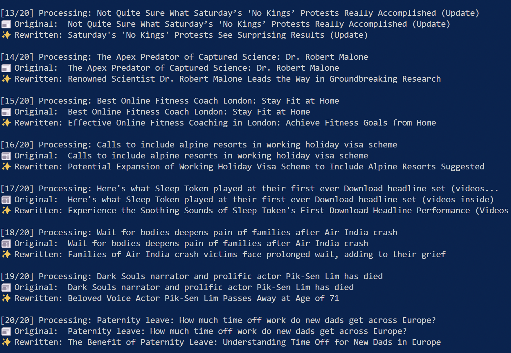
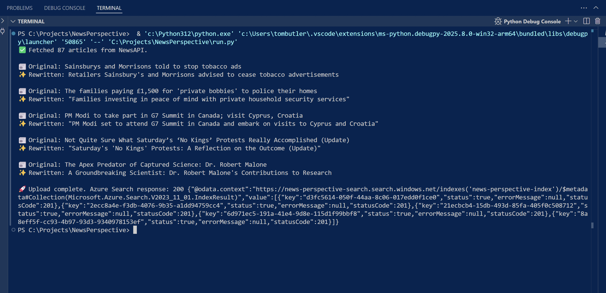

# News Perspective

A tool to fetch news headlines and rewrite them in a more positive, factual tone. 

<p align="center"> &nbsp;&nbsp;  </p>

# Front End Demo Incoming 

## What It Does

1. Fetches headlines from [NewsAPI.org](https://newsapi.org/)
2. Analyses sentiment and identifies problematic language using Azure AI Language
3. Rewrites negative headlines in a calmer, more factual tone using Azure OpenAI
4. Indexes results in Azure AI Search for semantic retrieval
5. Provides a Streamlit web interface to browse and search the results

Built to help reduce doomscrolling and emotional bias caused by alarmist headlines.

## Setup

Prerequisites: You'll need Azure OpenAI and Azure AI Search configured.

1. Clone the repo
2. Create a `.env` file with these variables:

```
NEWS_API_KEY=your_newsapi_key
AZURE_OPENAI_KEY=your_azure_openai_key
AZURE_OPENAI_ENDPOINT=https://<your-region>.cognitiveservices.azure.com/
AZURE_OPENAI_DEPLOYMENT=gpt-35-turbo-instruct
AZURE_SEARCH_KEY=your_azure_search_key
AZURE_SEARCH_ENDPOINT=https://<your-search-name>.search.windows.net
AZURE_SEARCH_INDEX=news-perspective-index
AZURE_AI_LANGUAGE_ENDPOINT=https://<your-region>.cognitiveservices.azure.com/
AZURE_AI_LANGUAGE_KEY=your_azure_ai_language_key
AZURE_DOCUMENT_INTELLIGENCE_ENDPOINT=https://<your-region>.cognitiveservices.azure.com/
AZURE_DOCUMENT_INTELLIGENCE_KEY=your_azure_document_intelligence_key
```

Keep keys secure - never commit `.env` to git. Use Azure Key Vault for production.

3. Install dependencies:
```bash
pip install -r requirements.txt
```

4. Run the batch processor:
```bash
python batch_processor.py
```

Or run the simple version:
```bash
python run.py
```

## Usage

**Search the index:**
```bash
python search.py --keyword "technology"
python search.py --recent 24      # Last 24 hours
python search.py --source "BBC"   # Filter by source
python search.py --test          # Test connection
```

**Web interface:**
```bash
streamlit run web_app.py
```

## Tech Stack

- Python 3.9+
- Azure OpenAI (gpt-35-turbo)
- Azure AI Language
- Azure AI Document Intelligence
- Azure AI Search
- NewsAPI
- Streamlit (web UI)

## Files

- `batch_processor.py` - Main batch processing with enhanced analysis
- `run.py` - Simple single-run version
- `search.py` - CLI tool for searching the index
- `web_app.py` - Streamlit web interface
- `azure_ai_language.py` - Sentiment and entity analysis
- `azure_document_intelligence.py` - Content extraction from articles
- `logger_config.py` - Logging and stats tracking
